# 🛡️ Azure Sentinel SIEM & Honeypot Lab
### Cloud-native SIEM using Microsoft Sentinel to built a honeypot project focusing on monitoring and visualizing global RDP brute-force attacks in real-time.

## 📝 Project Overview
This project involved setting up a **Microsoft Azure** environment to act as a "Honeypot." I intentionally exposed a Windows VM with an open RDP port (3389) to the internet, to capture and analyzed brute-force attacks from around the world. Using a **PowerShell script** to improve the raw security logs with a visualizaion of geographic data results in **Microsoft Sentinel (SIEM)** via a live attack map.

## 📜 Credits & Acknowledgments
The custom PowerShell script used in this lab to bridge Windows Event Viewer data with the ipgeolocation.io API was authored by **Josh Madakor**. 
- [Link to the original script repository](https://github.com/joshmadakor1/Sentinel-Lab)

---

## 🛠️ Environments & Tools Used
- **Microsoft Azure** (VM, Log Analytics, Sentinel)
- **PowerShell** (Log Enrichment & Automation)
- **KQL (Kusto Query Language)** (Data transformation)
- **ipgeolocation.io API** (Geographic data mapping)

---

## 🚀 Step-by-Step Walkthrough

### 1. Provisioning the Cloud Infrastructure
Deployed a Windows Server 2022 VM and establishing the Log Analytics Workspace.

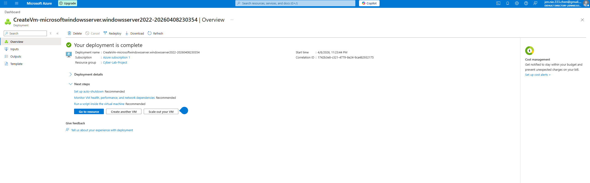
*Image 1: Successful deployment of the Windows Server Honeypot.*

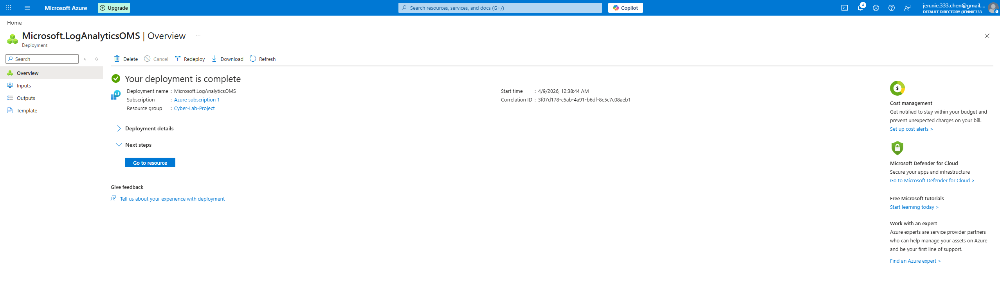
*Image 2: Provisioning the central repository for incoming security logs.*

### 2. Configuring the Honeypot (Intentional Vulnerability)
To attract global attackers, I modified the Network Security Group (NSG) to allow all inbound traffic on Port 3389 and disabled the internal Windows Firewall.

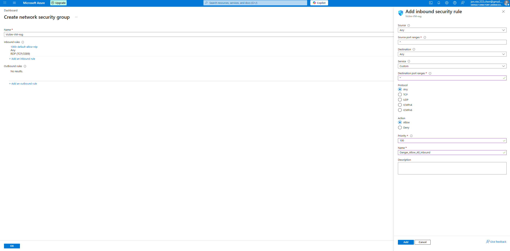
*Image 3: Opening the VM to the public internet.*

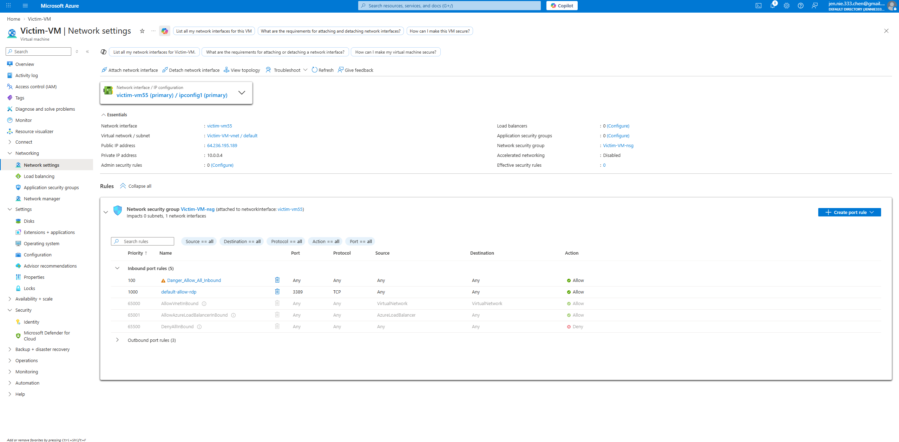
*Image 4: Allowing all inbound traffic on Port 3389.*

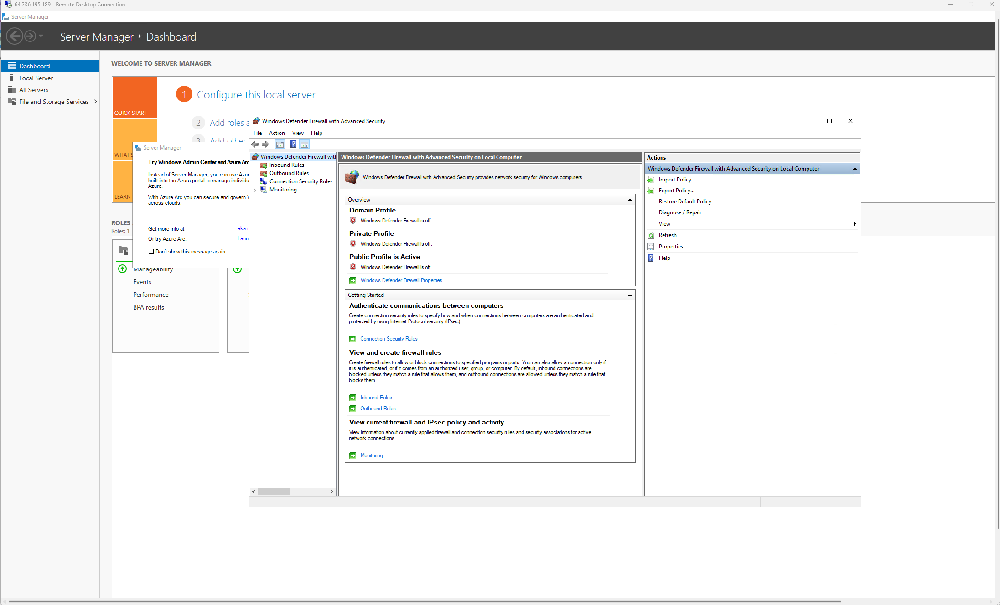
*Image 5: Disabling the local firewall to ensure log visibility.*

### 3. Log Enrichment & PowerShell Automation
I used **Josh Madakor**'s PowerShell script to monitor for "Failed RDP Logins" (Event ID 4625), query the Geolocation API, and write the new and improved data to a custom log file.

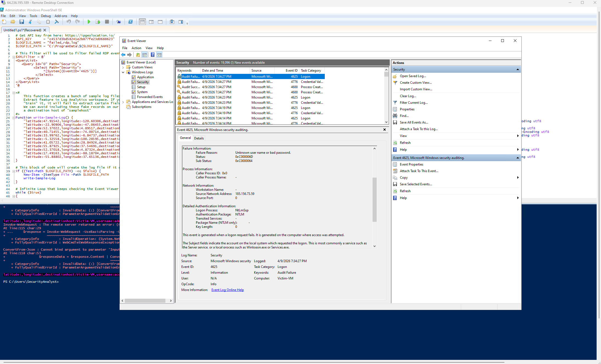
*Image 5: Identifying raw Audit Failure events in the Windows Security Log.*

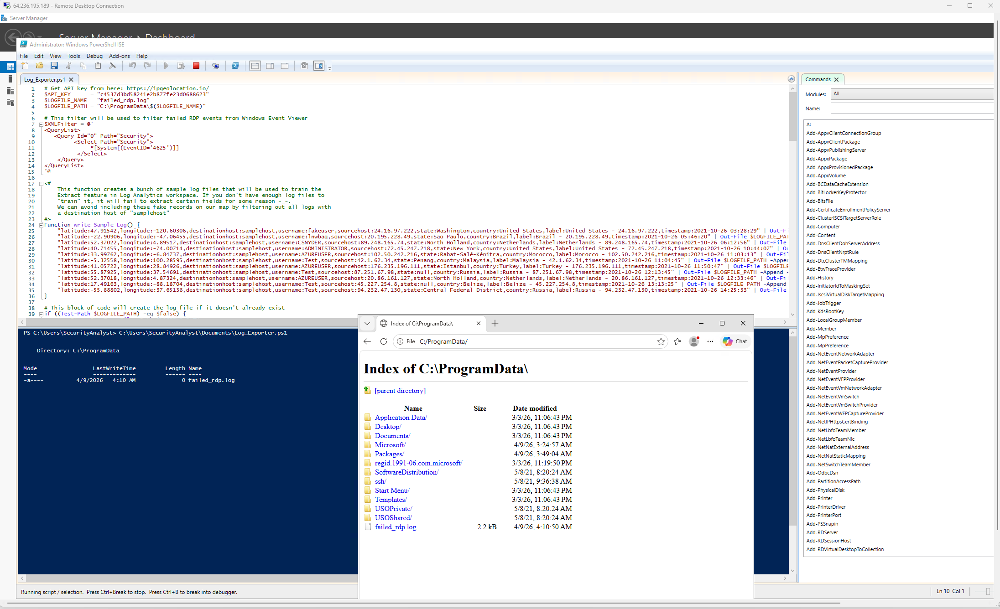
*Image 6: The PowerShell script intercepting these events and querying the Geolocation API.*

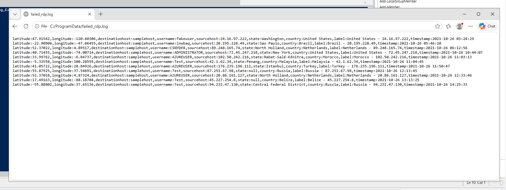
*Image 7: Log file populated with IP coordinates, Latitude, Longitude, and country data.*

### 4. Establishing the Sentinel Pipeline
Created a Data Collection Rule (DCR) and defined a custom table schema in Azure to collect and import the local log file from the VM into the cloud.

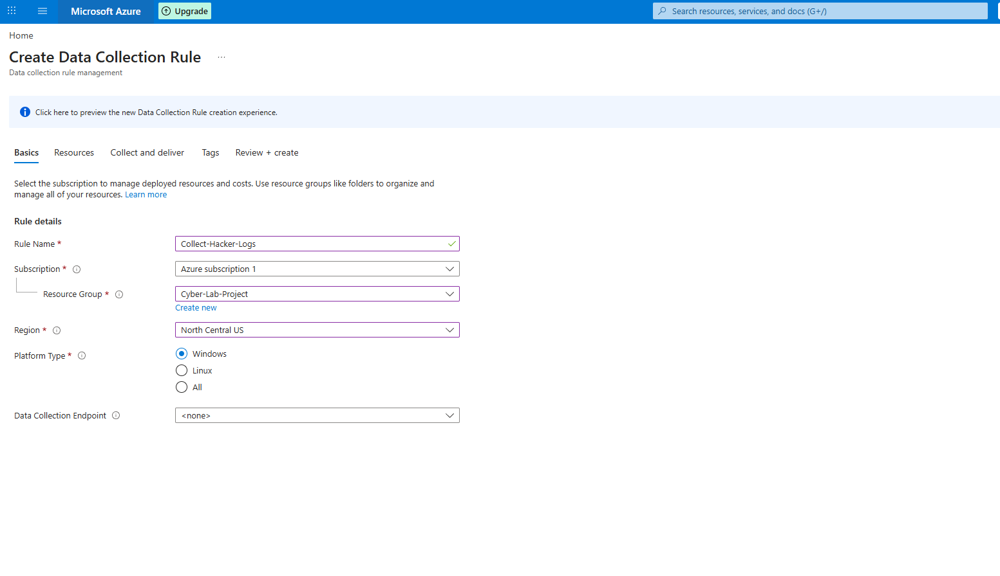
*Image 8: Defining the data ingestion pathway.*

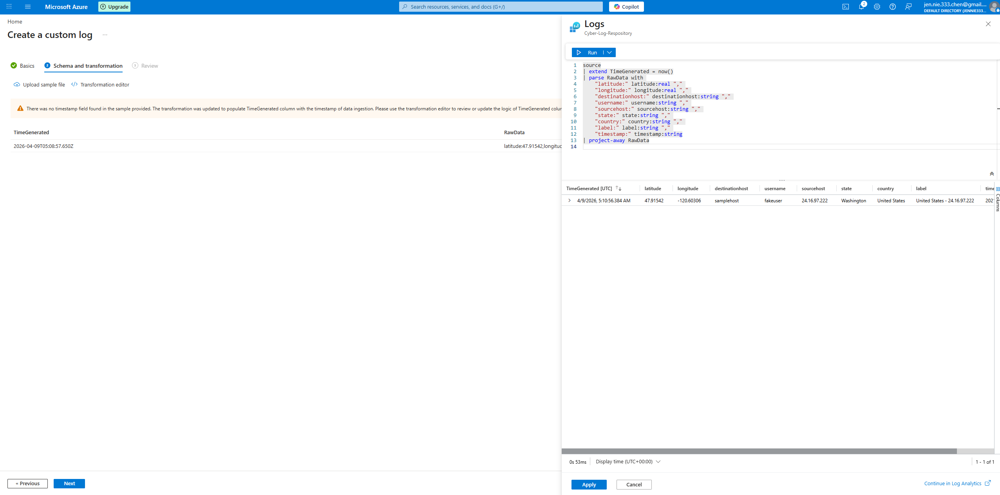
*Image 9: Using KQL to transform raw strings into structured columns.*

---

## 🛑 Challenges & Troubleshooting

**Issue 1: Regional Mismatch (Resource Group Sync)**
During the initial setup, I realized that the VM and the Log Analytics Workspace were being deployed in different regions (moving from the default, East US, to North Central US due to regional availability and the goal of staying strictly within the "Azure Subscription 1" (Free Trial) credits). This caused issues with the DCR mapping, resulting in a few redeployments.

**Solution:**
1. **Deleted the initial resources and redeployed the entire stack within the **North Central US** region to ensure full compatibility.**

**Issue 2: API Rate Limiting (Error 429)**
During the initial run, the VM was attacked thousands of times, exhausting the 1,000 daily API credits almost instantly.

**Solution:**
1. **Heartbeat Verification:** Confirmed the Azure Monitor Agent was still alive via KQL.
2. **NSG Whitelisting:** Restricted RDP access to "My IP" to stop bot noise.
3. **Failed RDP Login Test:** Performed a successful test with username `jennifer-test-2`.

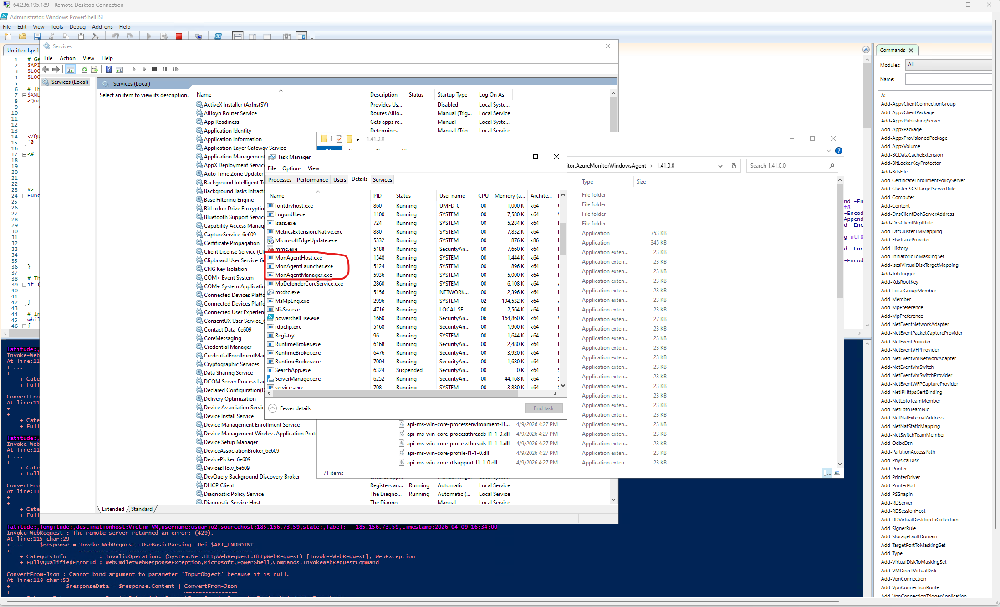
*Image 10: Identifying the API credit exhaustion via PowerShell errors.*
Specific error message: *Invoke-WebRequest : The remote server returned an error: (429) Too Many Requests.*
- Invoke-WebRequest: PowerShell's command trying to "call" the ipgeolocation.io website.
- (429) Too Many Requests: HTTP status code for "rate limit exceeded."

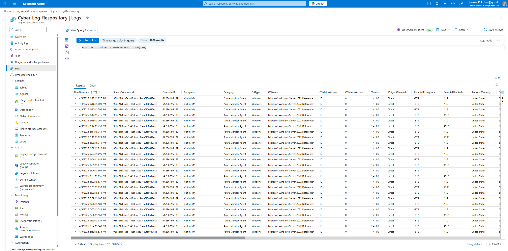
*Image 11: Verifying the data pipeline remains healthy.*

**Issue 3: Log Ingestion Silence & Path Mismatch**
The script was running properly and the logs were populating on the VM, but the data was not appearing in the Log Analytics Workspace. After investigating, it turns out that the AMA was being configured to watch a file path that was incorrectly mapped to the VM desktop profile.

**Solution:**
1. **DCR Update:** I had to manually reconfigure the DCR to include a "Custom Text Logs" data source specificially to the correct target path.
2. **KQL Transformation:** Verified that the KQL transformation logic was correctly parsing the `RawData` into the structured columns within the DCR's JSON configuration

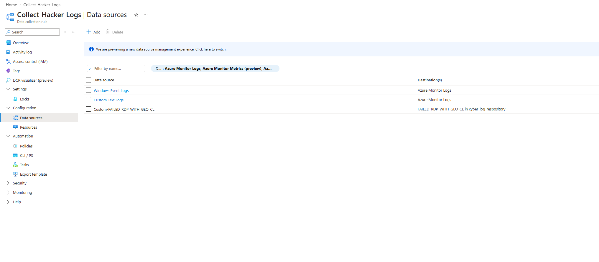
*Image 12: Manually mapping custom log path and transformation logic in Azure Portal*

**Issue4: Transformation Logic & Agent Latency**
Even after the DCR was correctly mapped to the file path, specific columns in Azure (latitude, longitude, username) all came up empty. "RawData" was recevied but the KQL was not successfully curring the data in the defined schema. 

**Solution:**
1. **Transformation Refinement:** I updated the DCR's KQL Transformation code from the default `source` to a specific `parse` logic. 
2. **Manual Agent Re-initialization:** Because the Azure Monitor Agent (AMA) runs as a hidden set of processes (MonAgentCore.exe), I used PowerShell to force-stop all MonAgent processes.

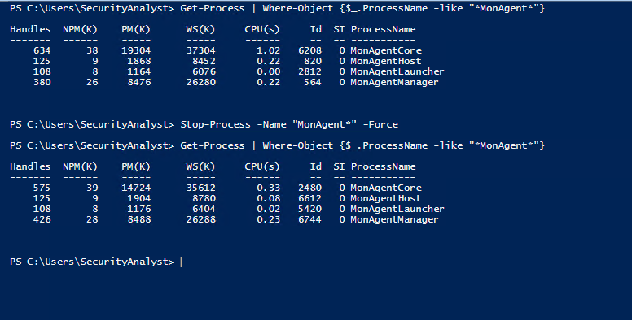
*Image 13: Powershell force-stop on MonAgent/AMA processes.*

---

## 📊 Results & Visualization
*Coming soon! Final global attack map will be updated once the API credits refresh.*
